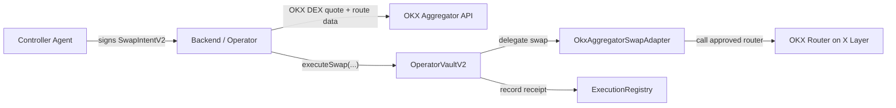

# OperatorVaultV2 Swap-Only Implementation Plan

## Overview
This plan upgrades the current single-router, single-swap vault into a swap-only execution layer that remains optimized for the OKX DEX aggregator while removing the main rigidity points in the current design. The goal is to keep the product narrow enough to ship quickly for the hackathon, while introducing the contract seams needed to support future venue-specific swap adapters without another full redesign.

## Goals
- Keep the product focused on swaps only.
- Preserve the current trust model: owner custody, controller-signed intents, operator-paid execution, onchain policy enforcement.
- Replace the hardcoded single-router execution path with a swap adapter abstraction.
- Support more flexible swap policies than `baseToken -> tokenOut` only.
- Keep OKX aggregator as the default and first supported swap venue.
- Leave a clean path for future venue-specific adapters such as a direct Uniswap swap adapter.

## Non-Goals
- Generalized arbitrary contract execution.
- Lending, LP, staking, bridge, or treasury actions.
- Multi-step atomic batch execution in V2.
- A marketplace of multiple operators in this phase.
- Per-protocol portfolio allocation logic onchain.

## Assumptions and Constraints
- Time-to-ship matters more than maximizing abstraction purity.
- The system should remain compatible with the existing backend/operator model.
- The operator remains offchain and trusted for route construction, but should be constrained by signed intent data and onchain policy.
- The initial V2 should work with the OKX DEX aggregator only, even if the contract model is adapter-ready.
- X Layer mainnet is the target chain (`chainId = 196`).

## Requirements

### Functional
- The owner can create a vault that supports swap execution through allowlisted swap adapters.
- The owner can allowlist input tokens, output tokens, and optionally exact token pairs.
- A controller signs a typed swap intent that names the adapter and constrains the execution payload.
- The operator can execute the swap only if the signed intent, policy checks, and adapter allowlist all pass.
- The vault records generalized swap receipts including the adapter used.
- The backend can request OKX quotes with optional routing filters such as `dexIds` and `excludeDexIds`.

### Non-Functional
- The onchain validation path must stay easy to reason about and auditable.
- Contract surface area should grow minimally from the current V1.
- Existing guarantees must remain: nonce uniqueness, deadlines, cooldowns, daily volume caps, slippage floor, owner pause.
- The system must be implementable without introducing arbitrary target calls from the vault.

## Technical Design

### Data Model
Introduce a swap-specific V2 intent and adapter interface.

```solidity
struct SwapIntentV2 {
    address vaultAddress;
    address controller;
    address adapter;
    address tokenIn;
    address tokenOut;
    uint256 amountIn;
    uint256 minAmountOut;
    uint256 nonce;
    uint256 deadline;
    bytes32 executionHash;
}
```

New state in `OperatorVaultV2`:

- `mapping(address => bool) public allowedSwapAdapters;`
- `mapping(address => bool) public allowedInputTokens;`
- `mapping(address => bool) public allowedOutputTokens;`
- `mapping(address => mapping(address => bool)) public allowedPairs;`
- `mapping(uint256 => bool) public usedNonces;`

Retained policy state:

- `owner`
- `authorizedOperator`
- `maxAmountPerTrade`
- `maxDailyVolume`
- `maxSlippageBps`
- `cooldownSeconds`
- `paused`
- `currentDay`
- `dailyVolumeUsed`
- `lastExecution`
- `authorizedControllers`

Registry receipt additions:

- `adapter`
- optional `venueLabel` or `adapterType` can remain offchain for now

### API Design
No user-facing API expansion is required beyond the existing execute/preview flow, but the request schema changes.

New shared types:

```ts
interface SwapIntentV2 {
  vaultAddress: string;
  controller: string;
  adapter: string;
  tokenIn: string;
  tokenOut: string;
  amountIn: string;
  minAmountOut: string;
  nonce: number;
  deadline: number;
  executionHash: string;
}
```

Backend request flow:

- `POST /preview`
  - returns quote, adapter, filtered routing metadata, and canonical `executionHash`
- `POST /execute`
  - accepts `SwapIntentV2`, `signature`, `paymentReference`
  - fetches the final execution payload from the OKX quote response or reconstructs it deterministically
  - checks `keccak256(executionData) == intent.executionHash`
  - sends `vault.executeSwap(intent, executionData, signature, paymentRef, registry)`

### Architecture



Key design choice:

- The vault validates policy and intent.
- The adapter owns protocol-specific approval and call logic.
- The adapter model is future-ready, but V2 ships with only one adapter: `OkxAggregatorSwapAdapter`.

### UX Flow (if applicable)
- Existing frontend flow can remain mostly unchanged for V2.
- New owner controls to add later:
  - allow/disallow input tokens
  - allow/disallow output tokens
  - allow/disallow swap adapters
- Optional future improvement:
  - show adapter used in history and dashboard receipts

---

## Implementation Plan

### Serial Dependencies (Must Complete First)

These tasks create foundations that other work depends on. Complete in order.

#### Phase 0: Spec and Compatibility Boundary
**Prerequisite for:** All subsequent phases

| Task | Description | Output |
|------|-------------|--------|
| 0.1 | Freeze V2 scope to swap-only, OKX-first, no arbitrary execution | Approved architecture boundary |
| 0.2 | Decide whether V1 and V2 coexist or V2 replaces factory default | Migration decision |
| 0.3 | Define canonical `executionHash` encoding format shared by backend and contracts | Stable hash contract |

#### Phase 1: Core Contract Foundations
**Prerequisite for:** Backend integration, tests, deploy scripts

| Task | Description | Output |
|------|-------------|--------|
| 1.1 | Add `ISwapAdapter` interface with a narrow `executeSwap` method | Adapter interface |
| 1.2 | Implement `OperatorVaultV2` with adapter allowlist and token/pair policy checks | New vault contract |
| 1.3 | Generalize receipt shape in registry to include adapter address | Registry V2 contract or compatible extension |
| 1.4 | Update factory to deploy `OperatorVaultV2` with an initial OKX adapter | Factory V2 |

---

### Parallel Workstreams
These workstreams can be executed independently after Phase 1.

#### Workstream A: OKX Swap Adapter
**Dependencies:** Phase 1
**Can parallelize with:** Workstreams B, C

| Task | Description | Output |
|------|-------------|--------|
| A.1 | Implement `OkxAggregatorSwapAdapter` with router + approval target immutables | Adapter contract |
| A.2 | Ensure adapter validates router target or trusted call destination before execution | Swap venue guardrails |
| A.3 | Add unit tests for approval handling, success path, and invalid router path | Contract tests |

#### Workstream B: Shared Types and Signing
**Dependencies:** Phase 1
**Can parallelize with:** Workstreams A, C

| Task | Description | Output |
|------|-------------|--------|
| B.1 | Replace `ExecutionIntent` with `SwapIntentV2` in `packages/shared` | Shared type update |
| B.2 | Update EIP-712 domain types and hash helpers for V2 | Shared signing helpers |
| B.3 | Add helpers to compute and verify `executionHash` | Stable client/backend hashing |

#### Workstream C: Backend Quote and Execution Path
**Dependencies:** Phase 1
**Can parallelize with:** Workstreams A, B

| Task | Description | Output |
|------|-------------|--------|
| C.1 | Update quote service to return canonical execution payload metadata | Quote contract |
| C.2 | Add support for `dexIds` and `excludeDexIds` passthrough in OKX quote requests | Configurable routing filters |
| C.3 | Update validator to check adapter, allowed tokens/pairs, and intent hash semantics | V2 backend validator |
| C.4 | Update executor to call `OperatorVaultV2.executeSwap` using adapter-based flow | Backend V2 execution |

#### Workstream D: Frontend and Operator Controls
**Dependencies:** Phase 1
**Can parallelize with:** Workstreams A, B, C

| Task | Description | Output |
|------|-------------|--------|
| D.1 | Update frontend ABIs for V2 vault and factory | UI compatibility |
| D.2 | Replace base-token-only messaging with input/output token policy controls | Correct UX copy |
| D.3 | Show adapter used and broader swap permissions in dashboard/history | Improved transparency |

---

### Merge Phase

After parallel workstreams complete, these tasks integrate the work.

#### Phase 2: Integration
**Dependencies:** Workstreams A, B, C, D

| Task | Description | Output |
|------|-------------|--------|
| 2.1 | Wire deploy scripts and env defaults to V2 factory and OKX adapter | Deployable mainnet config |
| 2.2 | Update backend ABI and route flow for V2 receipts/events | Integrated execution path |
| 2.3 | Run end-to-end mainnet fork or test environment validation | Verified swap flow |
| 2.4 | Update docs and README positioning to explain V2 flexibility without overclaiming | Messaging alignment |

---

## Testing and Validation

- Contract unit tests:
  - valid signed swap through OKX adapter
  - unauthorized adapter rejected
  - unauthorized controller rejected
  - nonce replay rejected
  - expired intent rejected
  - token input/output not allowlisted rejected
  - disallowed token pair rejected
  - amount cap rejected
  - daily volume cap rejected
  - cooldown rejected
  - execution hash mismatch rejected
  - min amount out/slippage rejected
- Shared tests:
  - EIP-712 signing and recovery for `SwapIntentV2`
  - `executionHash` consistency between client/backend/contract assumptions
- Backend integration tests:
  - preview returns deterministic execution hash
  - execute rejects payload mismatch
  - execute accepts quote filters for `dexIds` and `excludeDexIds`
- Manual validation:
  - deploy vault
  - allow input/output tokens
  - sign a swap intent
  - pay fee through `x402`
  - execute through OKX adapter
  - confirm receipt and dashboard history

## Rollout and Migration

- Keep V1 contracts untouched.
- Deploy `ExecutionRegistryV2` only if receipt compatibility requires a schema change; otherwise extend carefully.
- Deploy `VaultFactoryV2` pointing to `OperatorVaultV2` + `OkxAggregatorSwapAdapter`.
- Treat V2 as the new default for new vaults.
- Leave existing V1 vaults operational but documented as swap-MVP legacy.
- Rollback path:
  - switch frontend/factory defaults back to V1
  - keep V2 contracts deployed but not default

## Verification Checklist

- `cd packages/contracts && forge build`
- `cd packages/contracts && forge test`
- `npm run build`
- `npm run typecheck`
- Manual:
  - create V2 vault
  - authorize controller
  - allow tokenIn and tokenOut
  - sign `SwapIntentV2`
  - call preview and confirm `executionHash`
  - pay `x402` fee
  - execute swap
  - confirm receipt includes adapter address
  - confirm policy limits still block invalid swaps

## Risk Assessment

| Risk | Likelihood | Impact | Mitigation |
|------|------------|--------|------------|
| `executionHash` format differs between backend and signing clients | Med | High | Define canonical hashing spec before coding and test across packages |
| Adapter abstraction adds complexity without immediate product value | Med | Med | Ship with one adapter only and keep interface minimal |
| Registry receipt migration breaks compatibility with frontend/indexer | Med | Med | Extend schema conservatively or version receipt readers |
| Allowing arbitrary token inputs widens risk surface | High | Med | Require explicit input token and pair allowlists |
| OKX quote payload changes unexpectedly | Med | High | Hash only canonical execution payload and validate router destination in adapter |
| Frontend still communicates V1 mental model | High | Med | Update copy and controls before demoing V2 |

## Open Questions

- [ ] Should `allowedPairs` be mandatory, or should `allowedInputTokens` + `allowedOutputTokens` be sufficient for V2?
- [ ] Does the registry need a new receipt struct version, or can `adapter` be appended compatibly?
- [ ] Should `minAmountOut` be fully signed by the controller, or recomputed by the backend from policy and quote?
- [ ] Should the factory install one default adapter only, or multiple adapters that owners opt into?
- [ ] Do we want the adapter to own approvals, or should the vault continue approving a fixed target per swap?

## Decision Log

| Decision | Rationale | Alternatives Considered |
|----------|-----------|------------------------|
| Keep V2 swap-only | Preserves focus and delivery speed | Full generalized action executor |
| Ship OKX aggregator as first adapter | Best execution and lowest integration effort | Direct venue-specific adapter first |
| Introduce adapter abstraction now | Avoids another contract redesign later | Keep single trusted router and refactor later |
| Add `executionHash` to signed intent | Binds signed authorization to actual execution payload | Rely on backend honesty alone |
| Remove `tokenIn == baseToken` restriction | Unlocks rebalancers and broader swap agents | Keep base-token-only MVP |
